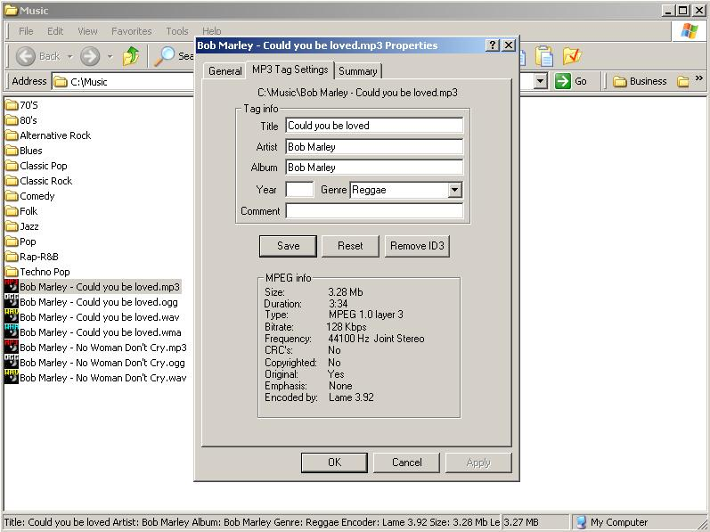



## MP3 Property Page

### Description

This is an explorer property page shell extension which will allow you to edit mp3 tag properties. By adding an empty dialog and plopping a vb form on top you can handle all the programming in vb instead of c++. There is a .dll required that is available at http://www.programmersheaven.com/search/download.asp?FileID=38704. The propext.dll is essential since you cannot call a function pointer in vb.(that I'm aware of)It allows the adding of the empty dialog, on top of which the vb form is placed. This can of course be applied to any file extension. You can make your own custom property page. I have found many instances where an external .dll written in c++ can extend vb into an extremely robust language. Too bad they aren't allowed to be submitted for security reasons.
 
### More Info
 

             |
---                |---
**Submitted On**   |2005-02-13 07:54:40
**By**             |[jjprogrammer](https://github.com/Planet-Source-Code/PSCIndex/blob/master/ByAuthor/jjprogrammer.md)
**Level**          |Advanced
**User Rating**    |5.0 (10 globes from 2 users)
**Compatibility**  |VB 5\.0
**Category**       |[Sound/MP3](https://github.com/Planet-Source-Code/PSCIndex/blob/master/ByCategory/sound-mp3__1-45.md)
**World**          |[Visual Basic](https://github.com/Planet-Source-Code/PSCIndex/blob/master/ByWorld/visual-basic.md)
**Archive File**   |[MP3\_Proper1854112172005\.zip](https://github.com/Planet-Source-Code/jjprogrammer-mp3-property-page__1-58972/archive/master.zip)

